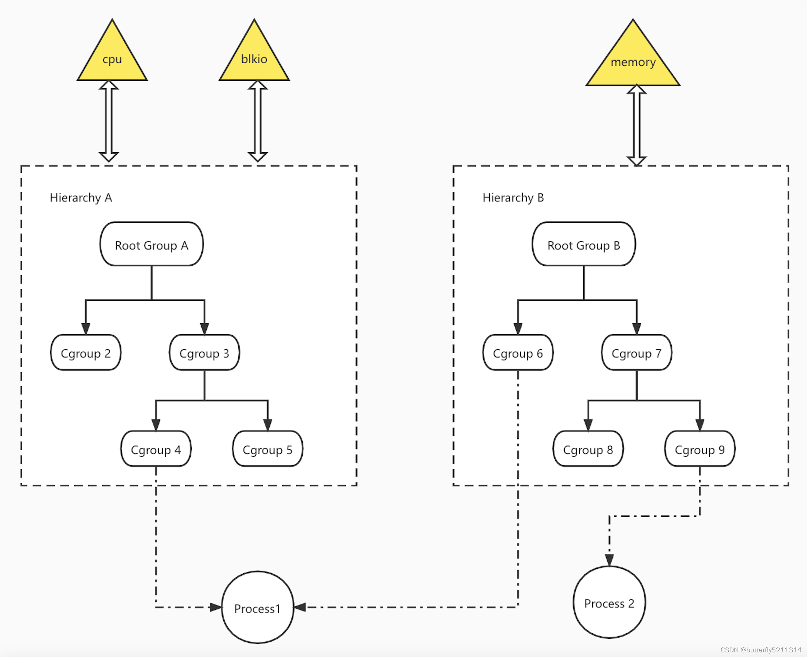

# containerexample

## Linux Namespace
众所周知，Linux是多用户的操作系统，为了让每个用户看起来都在独立使用该系统，就需要对不同的用户进行资源隔离。所以Namesapce诞生了，是Linux系统用来隔离系统资源的一个功能。隔离不同的资源要用到不同的Namespace。

Linux共有6个Namespace:
* UTS Namespace
* IPC Namespace
* PID Namespace
* Mount Namespace
* USER Namespace
* Network Namespace

### UTS Namespace
隔离两个系统标识: `nodename`和`domainname`, 在UTS Namespace里，每个`Namespace`允许有自己的`hostname`。

观察进程树，我们可以看到父进程的PID，于是可以通过readlink /proc/PID/ns/uts 命令去看看父进程和子进程是否是不在同一个UTS namespace。
执行hostname -b newhostname， 可以发现外部的hostname并没有改变。

### IPC Namespace
进程间通讯的机制称为 IPC(Inter-Process Communication)。Linux 下有多种 IPC 机制：

* 管道（PIPE）
* 命名管道（FIFO）
* 信号（Signal）
* 消息队列（Message queues）
* 信号量（Semaphore）
* 共享内存（Share Memory）
* 内存映射（Memory Map）
* 套接字（Socket）

Linux 的 IPC Namespace 主要就是针对其中的三种：
* 消息队列（Message queues）
* 信号量（Semaphore）
* 共享内存（Share Memory）

### PID Namespace
隔离进程ID。同样一个进程在不同的PID Namespace里可以拥有不同的PID。这样就可以理解，在docker container里面，使用ps -ef经常会发现，在容器内，前台运行的那个进程PID是1，但是在容器外，使用ps -ef会发现同样的进程却有不同的PID，这就是PID Namespace做的事情。

### Mount Namespace
隔离各个进程看到的挂载点视图。在不同Namespace的进程中到的文件系统层次是不一样的。在Mount Namespace中调用mount()和umount()仅仅只会影当前Namespace内的文件系统，而对全局的文件系统是没有影响的。

### USER Namespace
隔离用户的用户组ID。也就是说，一个进程的UserID和GroupID在User Namespace内外可以是不同的。比较常用的是，在宿主机上以一个非root用户运行创建一个User Namespace，然后在User Namespace里面却映射成root用户。

这意味着，这个进程在User Namespace里面有root权限，但是在User Namespace外面却没有root的权限。

### Network Namespace
隔离网络设备、IP 地址端口等网络栈的Namespace。Network Namespace可以让每个容器拥有自己独立的(虚拟的)网络设备，而且容器内的应用可以绑定到自己的端口，每个Namespace内的端口都不会互相冲突。在宿主机上搭建网桥后，就能很方便地实现容器之间的通信，而且不同容器上的应用可以使用相同的端口。

## Linux CGroups (Control Groups)
提供了对一组进程及将来子进程的资源限制、控制和统计的能力，这些资源包括 CPU、内存、存储、网络等 。 通过 Cgroups，可以方便地限制某个进程的资源占用，并且可以实时地监控进程的监控和统计信息。包含三个组件:

* cgroup: 对进程分组管理的一种机制， 一组task和一组subsystem的配置参数。一个task对应一个进程, cgroup是资源分片的最小单位。
* subsystem: 一组资源控制的模块。每个 subsystem 会关联到定义了相应限制的 cgroup 上，并对这个cgroup 中的进程做相应的限制和控制。
* hierarchy: 把一组`cgroup`串成一个树状的结构，一个这样的树便是一个`hierarchy`，通过这种树状结构， Cgroups可以做到继承。比如通过创建cgroup1对某个进程限制了CPU使用率。其某个子进程还需要限制磁盘IO，那么可以创建cgroup2继承于cgroup1，然后通过cgroup2限制某个子进程的磁盘IO，并且自动继承了CPU的限制。


> 黄色三角是subsystem

从图中可以看到三者的关系:
* 一个 subsystem 只能附加到一个 hierarchy 上面。
* 一个 hierarchy 可以附加多个 subsystem 。
    * `blkio` 设置对块设备（比如硬盘）输入输出的访问控制
    * `cpu` 设置 cgroup 中进程的 CPU 被调度的策略
    * `cpuacct` 统计 cgroup 中进程的 CPU 占用
    * `cpuset` 多核机器上设置 cgroup 中进程可以使用的 CPU 和内存
    * `memory` 控制 cgroup 中进程的内存占用
    * `devices` 控制 cgroup 中进程对设备的访问
    ...

* 一个进程可以作为多个 cgroup 的成员，但是这些 cgroup 必须在不同的 hierarchy 中 。

通俗理解：Cgroup是规则的制定者，声明了哪些进程需要遵守哪些规则。subsystem是规则的执行者，根据Cgroup制定的规则来限制进程使用的资源。hierarchy是制定者的树状集合，用来区分cgroup的辈分。

限制资源实验:

`mount | grep memory` 找到系统默认给memory subsytem创建的hierarchy的挂载点, 在这个hierarchy下创建cgroup, 限制进程占用的内存。

```txt
cat memory.limit_in_bytes
echo '100m' > memory.limit_in_bytes 
cat memory.limit_in_bytes
echo $$
echo $$ > tasks # 将当前shell添加到cgroup
stress --vm-bytes 500m --vm-keep -m 1 # 启动一个占用500m的进程
stress --vm-bytes 99m --vm-keep -m 1 # 启动一个占用99m的进程
```
